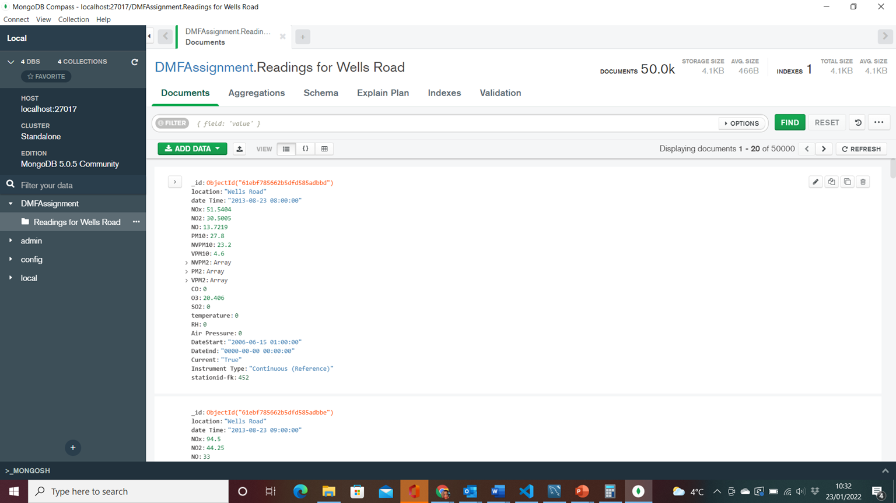

# A REPORT ON THE DATA MODEL USED AND THE IMPLEMENTATION DETAILS INVOLVED FOT TASK 5
A NoSQL database is an approach to database management that can accommodate an extensive selection of data models. The term NoSQL stands for **Not only SQL** and this means that NoSQL databases supports SQL, and the NoSQL database systems are also open source. There are different types of NoSQL database systems but the NoSQL database system I used to model my data for my chosen monitor (station) from my database to a NoSQL data model was **MongoDB**. MongoDB serves as a tool for management of a document-based information. It can also be used for storage and retrieval of information. 

For this assignment, I chose to use **MongoDB** because of the many benefits associated with it. It has a flexible schema approach makes it a famous tool for development teams practicing agile methodologies. MongoDB has a speed 100 times faster than all the relational databases. With attributes like gridFS and replication, it permits an increase in the availability of data. It provides very high performance and makes it easy for documents to be accessed/used. 
Before I started this assignment, I went through the tasks and became nervous. I felt the task required a lot of professional expertise which I wasn’t sure I had. I had no idea what was expected of me, so I decided to further research on NoSQL. Two NoSQL database types picked my interest, so I had to make a choice between both, Couchbase or MongoDB. I ended up picking MongoDB because it was easier to understand and use while still delivering on the job as desired. It eased the fear I felt at the onset of the assignment. Looking back, I’m feeling satisfied with my choice.

MongoDB was easily my choice because it is easy, very quick to adopt as no exceptional skill is required. However, the first part of the assignment required more skills. The data I worked with was a csv file containing details of readings of various air borne pollutants taken at different monitors/stations. I was tasked with querying the table and database I earlier created using the csv file, to get the readings of only one station. I wrote a query on MySQL workbench to extract the details for one station called **Wells Road**.  After which, I exported the output as a json file. I proceeded to download and install my MongoDB, the MongoDB compass and MongoDB shell.  After a successful installation, I created a database and a collection inside the MongoDB database and then imported my JSON file, thereby successfully modelling my data for my chosen “Wells Road” station from my database to a MongoDB NoSQL data model.

Here is the link to the JSON file:
[JSON_FILE](task_5.json)

And the screenshot below shows the data in MongoDB:

The part of this assignment that posed a bit of a challenge was my inability to write a query that comfortably extracts all the columns without the primary key column labelled, “Readingsid”. There was need to exclude the primary key because MongoDB automatically assigns a primary key to a document upon insert. After several attempts and trials, I resorted to selecting the columns I needed by inputting each header in query and although this is not exactly how I would have preferred to do it, it gave me the desired.

I realised the reason my initial queries didn’t work was because I tried using the SELECT EXCEPT statement. I completely misunderstood and wrongly implemented this statement. The approach I ended up using worked well because I already had the names of the headers for the columns I needed. Having experienced in the past that faster and shorter approaches save time while doing a cleaner job, I got too fixated on getting a shorter query. I thought this approach would save me time, but it ended up costing me far more time than expected and I ended up using the longer approach. I think the fact I did not do more research was a major contributing factor.
Working on this assignment, I learned so much at every step but most importantly, I learnt a lot about NoSQL databases and MongoDB to be precise. Hearing and reading about things are different from experiencing those things. I was able to see difference in data representation in NoSQL databases compared to relational databases. For MySQL, the tables and columns are expected to be properly defined while MongoDB does not require defining the schema. Also, MongoDB unlike SQL, works with unstructured data. Lastly, I learned that for a timed assignment or assessment, one needs to work with an available approach, it might not be faster, but it gets the job done and doesn’t waste as much time as the time spent searching for a fast approach.

If I had to do this task again, I will still use MongoDB. From download to installation to set up to actual usage, MongoDB ticked all the boxes for me. An application should not be too complicated, it should be easy and seamless. MongoDB understood this and delivered. I’m confident this current experience will be enough to remind me that time is very limited. Going forward, I’ll focus more on using MongoDB to store my data.